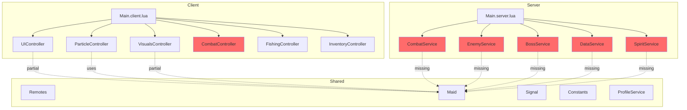

# Phase 37 - Architecture Review & Optimization Analysis

**Date:** 2026-01-17  
**Project:** Aetheria: The Omni-Verse

---

## 1. Executive Summary

This review identifies significant architectural issues requiring attention before Phase 37 game feel features are implemented. The primary concerns are:
- **Memory leaks** from untracked event connections in most server services
- **Object pooling** needed for damage numbers, particles, and enemies
- **Network optimization** opportunities for remote event consolidation

---

## 2. Memory Leak Prevention Analysis

### Files Using Maid Pattern ✅
| File | Status | Notes |
|------|--------|-------|
| [`ParticleController.lua`](../src/Client/Controllers/ParticleController.lua) | ✅ Good | Lines 14, 25-26 - proper Maid usage |
| [`VisualsController.lua`](../src/Client/Controllers/VisualsController.lua) | ⚠️ Partial | Line 9, 16 - Maid used but issues exist |
| [`UIController.lua`](../src/Client/Controllers/UIController.lua) | ⚠️ Partial | Line 16, 30 - Maid used but many untracked |

### Files Missing Maid Pattern 🔴

| File | Line | Issue |
|------|------|-------|
| [`CombatService.lua`](../src/Server/Services/CombatService.lua) | - | No Maid import, OnServerEvent connections untracked |
| [`EnemyService.lua`](../src/Server/Services/EnemyService.lua) | 96 | `RunService.Heartbeat:Connect` never cleaned |
| [`EnemyService.lua`](../src/Server/Services/EnemyService.lua) | 263 | `humanoid.HealthChanged:Connect` per-enemy not tracked |
| [`BossService.lua`](../src/Server/Services/BossService.lua) | 24, 38 | PlayerAdded/Heartbeat connections never cleaned |
| [`DataService.lua`](../src/Server/Services/DataService.lua) | 283-284 | PlayerAdded/Removing connections never cleaned |
| [`SpiritService.lua`](../src/Server/Services/SpiritService.lua) | 30-35 | PlayerAdded and CharacterAdded connections untracked |
| [`CombatController.lua`](../src/Client/Controllers/CombatController.lua) | - | No Maid pattern at all |

### Partial Maid Usage Issues

| File | Line | Issue |
|------|------|-------|
| [`VisualsController.lua`](../src/Client/Controllers/VisualsController.lua) | 219 | `char.ChildAdded:Connect` not tracked by Maid |
| [`VisualsController.lua`](../src/Client/Controllers/VisualsController.lua) | 489 | `RunService.RenderStepped:Connect` in ShakeCamera not tracked |
| [`UIController.lua`](../src/Client/Controllers/UIController.lua) | 70-101 | Remote event OnClientEvent connections not tracked |
| [`UIController.lua`](../src/Client/Controllers/UIController.lua) | 292-303 | HealthChanged connections per-character not tracked |
| [`ParticleController.lua`](../src/Client/Controllers/ParticleController.lua) | 32-46 | OnClientEvent connections not tracked by Maid |
| [`ParticleController.lua`](../src/Client/Controllers/ParticleController.lua) | 311 | DoScreenShake creates untracked RenderStepped connection |

---

## 3. Network Optimization

### Current Remote Events Analysis
[`Remotes/init.lua`](../src/Shared/Remotes/init.lua) creates **27 remote events** and **7 remote functions**.

### Consolidation Opportunities

| Current Remotes | Proposed Consolidation |
|-----------------|----------------------|
| ShowDamage, OnCombatHit, OnEnemyDeath | → `CombatFeedback` with type field |
| BossSpawned, BossUpdate, BossAttack, BossDefeated, BossUniqueId | → `BossEvent` with action enum |
| DataChanged, UpdateHUD, GoldUpdate | → `DataSync` with delta updates |
| QuestUpdate + AcceptQuest + CompleteQuest | → `QuestSync` single remote |

### Delta Compression Candidates
- `UpdateHUD` currently sends full data object - should send only changed fields
- Enemy position updates could batch multiple enemies per frame
- Boss health updates every damage tick - batch with debounce

---

## 4. Object Pooling Candidates

### High Priority 🔴
| Entity | Location | Frequency |
|--------|----------|-----------|
| Damage Numbers | [`ParticleController.lua:257-300`](../src/Client/Controllers/ParticleController.lua:257) | Every hit |
| Damage Numbers | [`VisualsController.lua:331-366`](../src/Client/Controllers/VisualsController.lua:331) | Every hit (duplicate!) |
| Hit Effects | [`ParticleController.lua:199-225`](../src/Client/Controllers/ParticleController.lua:199) | Every hit |
| Hit Effects | [`VisualsController.lua:506-528`](../src/Client/Controllers/VisualsController.lua:506) | Every hit |

### Medium Priority 🟡
| Entity | Location | Notes |
|--------|----------|-------|
| Enemies | `EnemyService` | Continuous spawning in zones |
| Telegraph Indicators | [`VisualsController.lua:553-619`](../src/Client/Controllers/VisualsController.lua:553) | Boss attacks |
| Spirit Visuals | `SpiritService` | On equip/character spawn |

### Note: Duplicate Systems
Both `ParticleController` and `VisualsController` handle:
- Damage numbers
- Hit effects
- Screen shake

**Recommendation:** Consolidate into single controller to avoid conflicts.

---

## 5. Performance Concerns

### Critical 🔴
| File | Line | Issue |
|------|------|-------|
| [`EnemyService.lua`](../src/Server/Services/EnemyService.lua) | UpdateEnemies | Iterates ALL enemies every Heartbeat frame |
| [`EnemyService.lua`](../src/Server/Services/EnemyService.lua) | FindNearestPlayer | O(n) player search per enemy per frame |

### Moderate 🟡
| File | Line | Issue |
|------|------|-------|
| [`UIController.lua`](../src/Client/Controllers/UIController.lua) | 124-129 | Zone check loop every 0.5s with magnitude calculations |
| [`VisualsController.lua`](../src/Client/Controllers/VisualsController.lua) | 605-615 | Pulse loop spawning tweens in delay loop |

### Recommendations
1. **Spatial partitioning** for enemy-player distance checks
2. **Zone caching** - only recalculate on significant movement
3. **Batch tween creation** for UI animations

---

## 6. Architecture Diagram

---

## 7. Prioritized Fixes

### Immediate (Before Phase 37)
1. Add Maid to all server services for connection cleanup
2. Consolidate duplicate damage/hit systems between ParticleController and VisualsController
3. Track all RunService connections with Maid

### Short-term
4. Implement object pool for damage numbers
5. Implement object pool for hit effects
6. Consolidate combat-related remotes

### Medium-term
7. Add spatial partitioning to EnemyService
8. Implement delta compression for data sync
9. Add enemy object pooling

---

## 8. Phase 37 Baseline Considerations

For new game feel systems:
- All new connections MUST use Maid pattern
- New particle/effect systems should use object pooling from the start
- New network events should batch updates where possible
- Consider using Signal module for internal events to decouple systems
