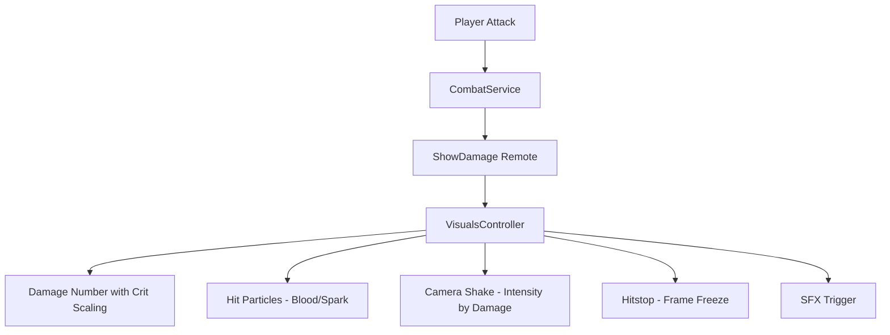
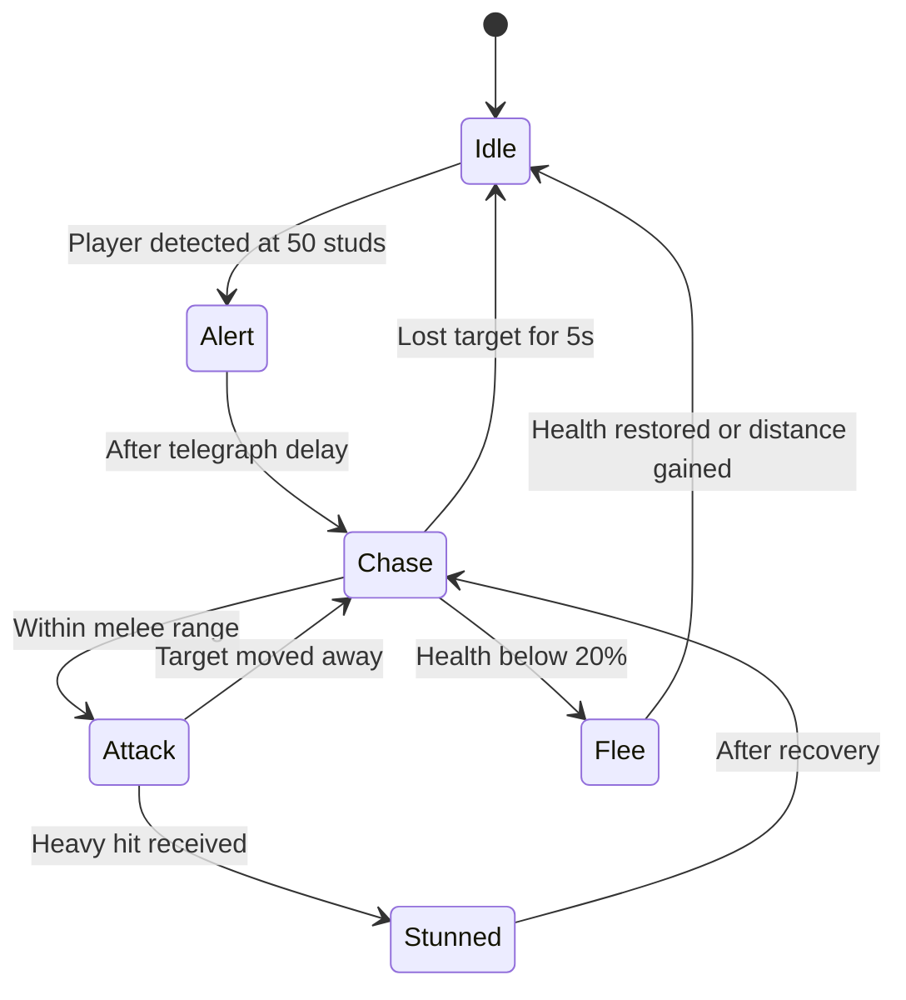
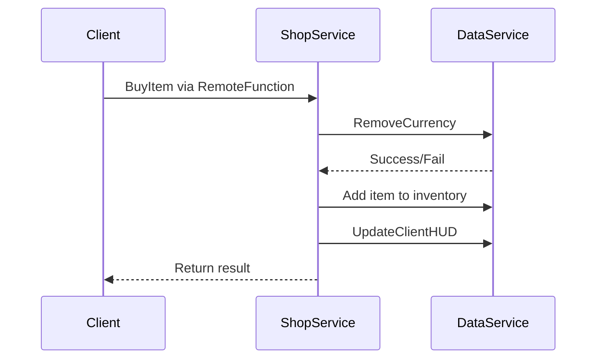

# Phase 37: Game Feel, Content Depth & Economy Integration

## Executive Summary

This plan addresses four major areas to enhance the Aetheria game experience: Combat Juice (VFX/SFX), Enemy AI improvements, Economy Loop integration, and UI Polish. Analysis reveals a solid foundation with key gaps in visual feedback and content depth.

---

## Current State Analysis

### Existing Services
| Service | Status | Key Findings |
|---------|--------|--------------|
| CombatService | Basic | Has cooldown, distance check, spirit bonus; fires `ShowDamage` to all clients |
| EnemyService | Functional | State machine (Idle/Chase/Attack), boss system, health bars, quest integration |
| ShopService | Minimal | Single item (Basic Sword), connects to DataService |
| DataService | Robust | ProfileService integration, escrow system, HUD updates |
| VisualsController | Partial | Has damage numbers, screen shake, hit effects; no particles |

### Missing Services
- **VFXService** (Server) - Coordinate server-authoritative visual events
- **SFXService** (Client) - Centralized sound management
- **ParticleService** (Client) - Environmental and combat particles

---

## 1. Combat Juice Implementation

### 1.1 VFX Enhancements

**Current State:**
- [`VisualsController:ShowDamageNumber()`](src/Client/Controllers/VisualsController.lua:176) - Basic billboard damage numbers
- [`VisualsController:PlayHitEffect()`](src/Client/Controllers/VisualsController.lua:351) - Simple expanding sphere
- [`VisualsController:ShakeCamera()`](src/Client/Controllers/VisualsController.lua:329) - Basic random offset shake

**Needed Additions:**



**Tasks:**
- [ ] Add critical hit detection in CombatService (currently placeholder `false`)
- [ ] Create hit particle emitters (slash trails, impact sparks)
- [ ] Implement hitstop (brief time pause on hit)
- [ ] Add damage number scaling (size/color by damage amount)
- [ ] Create attack swing VFX (weapon trail)

### 1.2 Screen Shake Improvements

**Current:** Basic random offset, no directional component

**Improvements:**
- Add directional shake (toward damage source)
- Implement intensity presets (light/medium/heavy)
- Add screen shake settings toggle for accessibility

### 1.3 SFX Hooks

**Create new `SFXController.lua`:**
```lua
-- Sound categories needed:
-- COMBAT: hit_light, hit_heavy, hit_critical, whoosh, block
-- ENEMY: spawn, death, aggro, attack_telegraph
-- UI: button_click, purchase_success, purchase_fail, level_up
-- AMBIENT: zone_enter, boss_music_start
```

**Integration points:**
- [`CombatService:HandleAttack()`](src/Server/Services/CombatService.lua:27) - Fire SFX event with attack
- [`EnemyService:HandleEnemyDeath()`](src/Server/Services/EnemyService.lua:414) - Death SFX
- [`UIController`](src/Client/Controllers/UIController.lua) - UI interaction sounds

---

## 2. Enemy AI Enhancements

### 2.1 Current State Machine

**Location:** [`EnemyService.lua`](src/Server/Services/EnemyService.lua:18-20)

```lua
local STATE_IDLE = "Idle"
local STATE_CHASE = "Chase"  
local STATE_ATTACK = "Attack"
```

**Current transitions:**
- IDLE → CHASE: Player within 40 studs
- CHASE → IDLE: Player beyond 60 studs
- CHASE → ATTACK: Player within 8 studs
- ATTACK → CHASE: Player beyond 10 studs

### 2.2 Proposed State Additions



**New States:**
- **Alert** - Telegraph before chase (visual warning to player)
- **Flee** - Low health retreat behavior
- **Stunned** - Interrupt state from heavy attacks

### 2.3 Difficulty Scaling by Distance from Hub

**Current:** Fixed values in [`Constants.COMBAT`](src/Shared/Modules/Constants.lua:267)

**Proposed scaling:**
```lua
-- Add to Constants.lua
ZONE_DIFFICULTY = {
    Hub = { EnemyHealthMult = 0, EnemyDamageMult = 0 }, -- Safe zone
    GlitchWastes = { EnemyHealthMult = 1.0, EnemyDamageMult = 1.0 },
    DeepWastes = { EnemyHealthMult = 1.5, EnemyDamageMult = 1.3 },
    BossArena = { EnemyHealthMult = 2.0, EnemyDamageMult = 1.5 }
}
```

**Tasks:**
- [ ] Add zone detection to EnemyService spawn logic
- [ ] Apply difficulty multipliers on spawn
- [ ] Scale XP rewards with difficulty
- [ ] Add visual indicators for enemy tier (aura colors)

### 2.4 Boss Attack Patterns

**Current:** [`EnemyService:UpdateBoss()`](src/Server/Services/EnemyService.lua:354) - Simple chase and melee

**Boss defined attacks in Constants:**
```lua
Attacks = {
    Spike = { Damage = 30, Range = 20, Cooldown = 5 },
    Corruption = { Damage = 10, Range = 100, Cooldown = 8, Duration = 5 }
}
```

**Implementation needed:**
- [ ] Add attack pattern selection logic
- [ ] Implement Spike attack (AoE ground slam)
- [ ] Implement Corruption attack (DoT zone)
- [ ] Add phase transitions at health thresholds
- [ ] Fire `BossAttack` remote for client VFX

---

## 3. Economy Loop Integration

### 3.1 Shop-DataService Connection

**Current flow:**


**Issues identified:**
1. Only 1 item in shop ([`ShopService.lua:10-17`](src/Server/Services/ShopService.lua:10))
2. No item categories
3. No dynamic pricing or stock limits

### 3.2 Shop Expansion Tasks

**Add to Constants.lua:**
```lua
SHOP_ITEMS = {
    Weapons = {
        BasicSword = { Cost = 50, Currency = "Essence", Damage = 15 },
        IronSword = { Cost = 200, Currency = "Essence", Damage = 25 },
        CrystalBlade = { Cost = 100, Currency = "Crystals", Damage = 40 }
    },
    Consumables = {
        HealthPotion = { Cost = 25, Currency = "Essence", Heal = 50, Stackable = true },
        SpeedBoost = { Cost = 50, Currency = "Essence", Duration = 30 }
    },
    Spirits = {
        SpiritEgg = { Cost = 100, Currency = "Essence", Gacha = true }
    }
}
```

### 3.3 Transaction Persistence

**Current:** [`DataService`](src/Server/Services/DataService.lua) uses ProfileService with auto-save

**Enhancements needed:**
- [ ] Add transaction logging for debugging
- [ ] Implement purchase cooldown to prevent spam
- [ ] Add server-side validation for item existence
- [ ] Create refund mechanism for failed deliveries

### 3.4 Currency Rewards Integration

**Current rewards:**
- Enemy kill → XP via [`SpiritService:AddExp()`](src/Server/Services/EnemyService.lua:433)
- No currency drops

**Add currency to enemy drops:**
```lua
-- In EnemyService:HandleEnemyDeath()
local essenceReward = enemy:GetAttribute("EssenceReward") or 5
DataService.AddCurrency(killer, "Essence", essenceReward)
```

---

## 4. UI Polish

### 4.1 Tween Animation Improvements

**Current tweens in UIController:**
- Health bar: [`TweenSize`](src/Client/Controllers/UIController.lua:290)
- Boss bar: [`TweenSize`](src/Client/Controllers/UIController.lua:1061)
- Shop popup: [`TweenSize`](src/Client/Controllers/UIController.lua:868)
- Zone label pulse: [`TweenInfo`](src/Client/Controllers/UIController.lua:390)

**Missing animations:**
- [ ] Button press feedback (scale bounce)
- [ ] Currency change animation (number counter)
- [ ] Inventory item pickup notification
- [ ] Damage taken screen flash

### 4.2 Environmental Particles

**Create ambient particle systems:**
- Hub: Floating essence motes
- Glitch Wastes: Corrupted data particles
- Azure Sea: Water spray, fish schools

**Implementation location:** New `ParticleController.lua` or extend `VisualsController`

### 4.3 UI Theme Consistency

**Current theme in UIController:**
```lua
local THEME = {
    GLASS_COLOR = Color3.fromRGB(20, 20, 35),
    GLASS_TRANSPARENCY = 0.4,
    ACCENT_COLOR = Color3.fromRGB(0, 170, 255),
    TEXT_COLOR = Color3.fromRGB(255, 255, 255),
    FONT = Enum.Font.GothamBold,
    CORNER_RADIUS = UDim.new(0, 12)
}
```

**Tasks:**
- [ ] Apply THEME consistently to all UI elements
- [ ] Add rarity colors for items/spirits
- [ ] Create loading/transition screens
- [ ] Add tooltip system for items

---

## 5. Optimization & Cleanup

### 5.1 Event Cleanup Patterns

**Current:** Maid module available at [`src/Shared/Modules/Maid.lua`](src/Shared/Modules/Maid.lua)

**Usage in UIController:** [`UIController.Maid = Maid.new()`](src/Client/Controllers/UIController.lua:30) - Created but not utilized

**Tasks:**
- [ ] Add Maid cleanup for all RBXScriptConnections in UIController
- [ ] Implement cleanup in VisualsController for particle emitters
- [ ] Add enemy cleanup on despawn (healthbar, effects)
- [ ] Clean up camera shake connections

### 5.2 Network Replication Concerns

**Current remote usage:**
- `ShowDamage`: FireAllClients (inefficient for large servers)
- `BossUpdate`: FireAllClients
- `UpdateHUD`: FireClient (correct)

**Optimizations:**
- [ ] Change `ShowDamage` to FireClient for attacker + players within range
- [ ] Throttle `BossUpdate` to max 10 updates/second
- [ ] Batch currency updates instead of per-kill
- [ ] Add client-side prediction for immediate feedback

### 5.3 Memory Management

**Issues:**
- Billboard GUIs created per damage number without pooling
- Parts created for hit effects without reuse

**Solutions:**
- [ ] Implement object pooling for damage numbers
- [ ] Reuse particle emitters instead of creating new
- [ ] Add part recycling for VFX

---

## Implementation Priority

### Phase 37A - Combat Feel (Critical)
1. Critical hit system in CombatService
2. Hitstop implementation
3. Enhanced damage numbers
4. SFX integration framework
5. Attack VFX trails

### Phase 37B - Enemy Depth
1. Alert state with telegraph
2. Flee behavior
3. Zone difficulty scaling
4. Boss attack patterns (Spike/Corruption)

### Phase 37C - Economy
1. Expand shop catalog in Constants
2. Currency drops from enemies
3. Transaction logging
4. Shop UI categories

### Phase 37D - Polish & Optimization
1. Button animations
2. Environmental particles
3. Event cleanup with Maid
4. Network optimization

---

## New Files Required

| File | Type | Purpose |
|------|------|---------|
| `src/Client/Controllers/SFXController.lua` | Client | Sound management |
| `src/Client/Controllers/ParticleController.lua` | Client | Environmental VFX |
| `src/Shared/Modules/ObjectPool.lua` | Shared | Reusable object pooling |

## Files to Modify

| File | Changes |
|------|---------|
| `CombatService.lua` | Add critical hits, SFX hooks |
| `EnemyService.lua` | New states, difficulty scaling, boss patterns |
| `ShopService.lua` | Expand to use Constants.SHOP_ITEMS |
| `Constants.lua` | Add SHOP_ITEMS, ZONE_DIFFICULTY, SFX_IDS |
| `UIController.lua` | Button animations, Maid cleanup |
| `VisualsController.lua` | Hitstop, enhanced VFX, particles |
| `DataService.lua` | Transaction logging, currency rewards |
