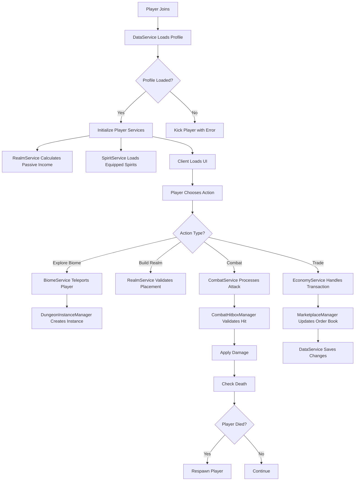
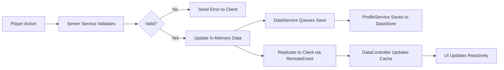
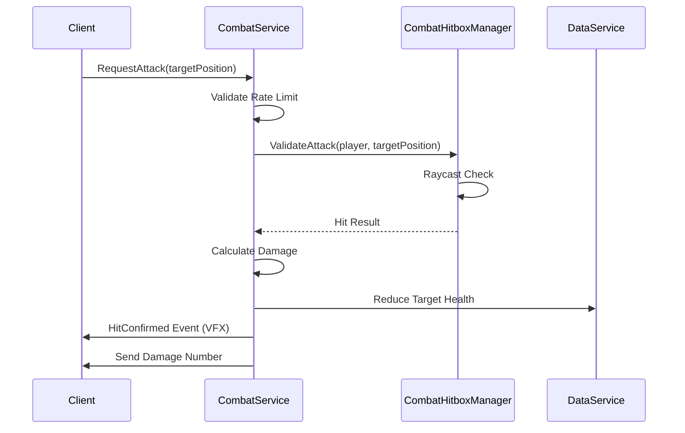
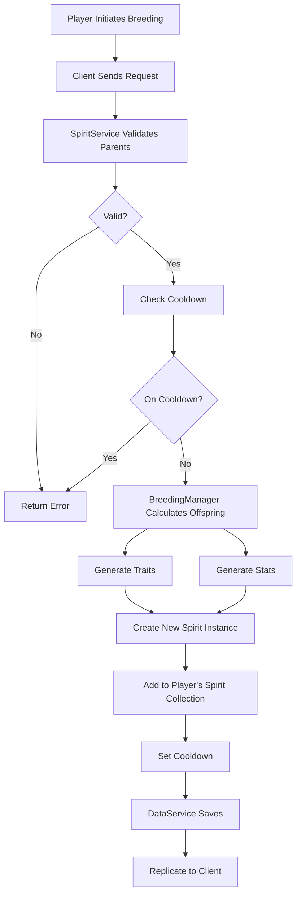

# Aetheria: The Omni-Verse - Technical Architecture Document

**Version:** 1.0  
**Date:** 2026-01-15  
**Status:** Design Phase  

---

## 1. Project Overview

### 1.1 Technical Goals

**Aetheria: The Omni-Verse** is a production-grade Roblox game that combines social hub mechanics, action-RPG combat, and a collectible Spirit economy. The technical architecture is designed to:

- **Scalability**: Support thousands of concurrent players across multiple server instances
- **Maintainability**: Use modern Luau patterns with clear separation of concerns
- **Performance**: Optimize for mobile devices while maintaining visual fidelity
- **Data Integrity**: Implement robust data persistence with ProfileService and session locking
- **Modularity**: Enable rapid iteration and feature additions through loosely coupled systems
- **Version Control**: Leverage Rojo for filesystem-based development with GitHub as source of truth

### 1.2 Core Technical Domains

1. **Realm System** - Player housing, passive income generation, social gatherings
2. **Combat System** - Real-time action combat with Spirit-based abilities
3. **Spirit Management** - Collection, breeding, genetics, and trading
4. **Economy** - Multi-currency system, marketplace, crafting
5. **Biome/World Management** - Dungeon instances, exploration, events
6. **Data Persistence** - Player profiles, inventories, and progress saving
7. **UI/UX** - Mobile-first interface with glassmorphism design

---

## 2. Directory Structure

### 2.1 Overview

```
src/
├── Server/          # ServerScriptService modules
│   ├── Services/    # Core game systems (singletons)
│   └── Managers/    # Sub-managers for complex domains
├── Shared/          # ReplicatedStorage modules
│   ├── Modules/     # Utility and shared logic
│   ├── Data/        # Configuration and constants
│   └── Types/       # Type definitions for strict typing
└── Client/          # StarterPlayer/StarterPlayerScripts
    ├── Controllers/ # Client-side game logic
    └── UI/          # Interface management
```

### 2.2 Server Architecture (`src/Server/`)

**Philosophy**: Server is authoritative for all game state, combat resolution, and data persistence. Uses a Service-Manager pattern where Services are top-level singletons that coordinate Managers for specific sub-domains.

```
Server/
├── Services/
│   ├── DataService.lua
│   ├── RealmService.lua
│   ├── CombatService.lua
│   ├── SpiritService.lua
│   ├── EconomyService.lua
│   ├── BiomeService.lua
│   ├── EventService.lua
│   └── TeleportService.lua
├── Managers/
│   ├── PlayerManager.lua
│   ├── SessionManager.lua
│   ├── RealmInstanceManager.lua
│   ├── CombatHitboxManager.lua
│   ├── BreedingManager.lua
│   ├── MarketplaceManager.lua
│   └── DungeonInstanceManager.lua
└── init.server.lua
```

### 2.3 Shared Architecture (`src/Shared/`)

**Philosophy**: Pure logic with no side effects. All modules should be stateless utilities or data containers that can be safely required from both server and client.

```
Shared/
├── Modules/
│   ├── Signal.lua              # Custom event implementation
│   ├── Promise.lua             # Async operations
│   ├── TableUtil.lua           # Deep copy, merge, etc.
│   ├── MathUtil.lua            # Vector math, rarity calculations
│   ├── ValidationUtil.lua      # Input sanitization
│   ├── GeneticsUtil.lua        # Spirit breeding algorithms
│   └── CombatUtil.lua          # Damage calculations, formulas
├── Data/
│   ├── Spirits/
│   │   ├── SpiritStats.lua     # Base stats for all spirit types
│   │   ├── SpiritAbilities.lua # Ability definitions
│   │   └── TraitDefinitions.lua
│   ├── Biomes/
│   │   ├── BiomeConfig.lua     # Biome parameters
│   │   └── DungeonLayouts.lua  # Procedural generation data
│   ├── Economy/
│   │   ├── Prices.lua          # Dynamic pricing formulas
│   │   └── LootTables.lua      # Drop rates
│   ├── Realms/
│   │   ├── BuildableItems.lua  # Furniture/structure definitions
│   │   └── RealmBuffs.lua      # Visit/party benefits
│   └── GameConfig.lua          # Global constants
└── Types/
    ├── PlayerData.lua          # Profile structure type
    ├── SpiritTypes.lua         # Spirit entity types
    ├── RealmTypes.lua          # Realm data types
    └── CombatTypes.lua         # Combat event types
```

### 2.4 Client Architecture (`src/Client/`)

**Philosophy**: Reactive UI driven by server state. Controllers listen to server events and update the UI. No authoritative logic runs on client.

```
Client/
├── Controllers/
│   ├── CameraController.lua    # Dynamic camera for combat/build modes
│   ├── InputController.lua     # Touch/keyboard input normalization
│   ├── CombatController.lua    # Client-side prediction, VFX
│   ├── RealmController.lua     # Building interface, furniture placement
│   ├── SpiritController.lua    # Spirit UI, inventory management
│   ├── UIController.lua        # Master UI state machine
│   ├── EffectsController.lua   # Particles, sounds, animations
│   └── DataController.lua      # Client cache of player data
├── UI/
│   ├── Components/
│   │   ├── HUD.lua             # Main gameplay HUD
│   │   ├── SpiritInventory.lua # Grid-based inventory
│   │   ├── Marketplace.lua     # Trading interface
│   │   ├── RealmBuilder.lua    # Furniture catalog and placement
│   │   ├── CombatSkills.lua    # Ability buttons
│   │   └── Notifications.lua   # Toast/alert system
│   ├── Screens/
│   │   ├── MainMenu.lua        # Start screen
│   │   ├── LoadingScreen.lua   # Async load handler
│   │   └── TeleportScreen.lua  # Biome selection
│   └── Themes/
│       ├── GlassmorphismTheme.lua # UI styling constants
│       └── MobileLayout.lua    # Responsive positioning
└── init.client.lua
```

---

## 3. File Specifications

### 3.1 Server Services (Detailed)

#### 3.1.1 `Server/Services/DataService.lua`

**Purpose**: Centralized player data management using ProfileService. Handles all profile operations, session locking, and data reconciliation.

**Key Functions**:
```lua
DataService.LoadPlayerProfile(player: Player): Promise<Profile>
DataService.SavePlayerProfile(player: Player): Promise<void>
DataService.GetPlayerData(player: Player): PlayerData?
DataService.UpdatePlayerData(player: Player, path: string, value: any): void
DataService.IncrementCurrency(player: Player, currencyType: string, amount: number): void
```

**Dependencies**:
- ProfileService (Wally package)
- `Shared/Types/PlayerData` (type definitions)
- `Shared/Modules/Signal` (for data change events)

**Data Schema**:
```lua
type PlayerData = {
    UserId: number,
    DisplayName: string,
    Currencies: {
        Aether: number,     -- Premium currency
        Essence: number,    -- Earned currency
    },
    Spirits: {SpiritInstance},
    Realm: RealmData,
    Inventory: {ItemInstance},
    Stats: PlayerStats,
    Settings: PlayerSettings,
}
```

---

#### 3.1.2 `Server/Services/RealmService.lua`

**Purpose**: Manages player Realms (floating islands). Handles instance creation, visitor tracking, passive income generation, and social events.

**Key Functions**:
```lua
RealmService.CreateRealmInstance(player: Player): Promise<RealmInstance>
RealmService.TeleportToRealm(visitor: Player, ownerId: number): Promise<void>
RealmService.PlaceFurniture(player: Player, itemId: string, cframe: CFrame): boolean
RealmService.StartRealmParty(player: Player): void
RealmService.CalculatePassiveIncome(player: Player): number
```

**Dependencies**:
- `Server/Managers/RealmInstanceManager` (separate server allocation)
- `Shared/Data/Realms/BuildableItems`
- `Shared/Modules/ValidationUtil` (placement validation)
- DataService (for saving realm state)

**Architecture Notes**:
- Realms are hosted on separate servers to allow higher part counts
- Instance creation is async to prevent main server stuttering
- Visitor buffs are tracked server-side to prevent exploits

---

#### 3.1.3 `Server/Services/CombatService.lua`

**Purpose**: Authoritative combat resolution. Validates client input, processes hitbox detection, applies damage, and manages Spirit abilities.

**Key Functions**:
```lua
CombatService.ProcessAttack(player: Player, spiritId: string, targetPosition: Vector3): void
CombatService.ActivateAbility(player: Player, abilityId: string, targets: {Player}): void
CombatService.ApplyDamage(target: Player, damage: number, damageType: string): void
CombatService.CheckDeath(player: Player): boolean
CombatService.RespawnPlayer(player: Player): void
```

**Dependencies**:
- `Server/Managers/CombatHitboxManager` (raycast validation)
- `Shared/Data/Spirits/SpiritAbilities`
- `Shared/Modules/CombatUtil` (damage formulas)
- SpiritService (to fetch equipped spirits)

**Performance Considerations**:
- Uses spatial partitioning for AOE abilities
- Rate limits client attack requests (max 3 attacks/second)
- Implements rollback for high-ping players

---

#### 3.1.4 `Server/Services/SpiritService.lua`

**Purpose**: Manages Spirit collection, breeding, genetics, and equipping. Coordinates with DataService for persistence.

**Key Functions**:
```lua
SpiritService.AwardSpirit(player: Player, spiritTypeId: string): SpiritInstance
SpiritService.BreedSpirits(player: Player, parentId1: string, parentId2: string): Promise<SpiritInstance>
SpiritService.EquipSpirit(player: Player, spiritId: string, slot: number): boolean
SpiritService.CalculateTraits(parent1: SpiritInstance, parent2: SpiritInstance): {Trait}
SpiritService.LevelUpSpirit(player: Player, spiritId: string): void
```

**Dependencies**:
- `Server/Managers/BreedingManager` (genetics algorithm)
- `Shared/Data/Spirits/SpiritStats`
- `Shared/Modules/GeneticsUtil` (trait inheritance)
- DataService (data persistence)

**Genetics System**:
- Traits are inherited probabilistically (Mendelian model with mutations)
- Max 5 traits per Spirit
- Breeding has cooldowns to prevent spam (stored in player data)

---

#### 3.1.5 `Server/Services/EconomyService.lua`

**Purpose**: Multi-currency management, marketplace transactions, crafting, and dynamic pricing.

**Key Functions**:
```lua
EconomyService.PurchaseItem(player: Player, itemId: string, quantity: number): boolean
EconomyService.ListOnMarketplace(player: Player, itemId: string, price: number): string -- Returns listing ID
EconomyService.BuyFromMarketplace(buyer: Player, listingId: string): boolean
EconomyService.CraftItem(player: Player, recipeId: string): boolean
EconomyService.ProcessDeveloperProduct(player: Player, productId: number): void
```

**Dependencies**:
- `Server/Managers/MarketplaceManager` (order book, anti-duping)
- `Shared/Data/Economy/Prices`
- DataService (currency transactions)

**Anti-Exploit**:
- All transactions are atomic (rollback on failure)
- Rate limiting on marketplace actions
- Price bounds validation (min/max prices)

---

#### 3.1.6 `Server/Services/BiomeService.lua`

**Purpose**: Manages world zones, dungeon instances, and environment hazards. Handles player teleportation between biomes.

**Key Functions**:
```lua
BiomeService.TeleportToBiome(player: Player, biomeId: string): Promise<void>
BiomeService.CreateDungeonInstance(players: {Player}, dungeonId: string): DungeonInstance
BiomeService.SpawnLoot(dungeonInstance: DungeonInstance, lootTableId: string): void
BiomeService.ApplyEnvironmentEffect(player: Player, effectId: string): void
```

**Dependencies**:
- `Server/Managers/DungeonInstanceManager` (procedural generation)
- `Shared/Data/Biomes/BiomeConfig`
- `Shared/Data/Economy/LootTables`
- TeleportService (cross-server coordination)

**Instance Architecture**:
- Dungeons are temporary instances (5-15 min lifetime)
- Max 4 players per dungeon instance
- Loot is distributed at completion (stored until claimed)

---

#### 3.1.7 `Server/Services/EventService.lua`

**Purpose**: Manages time-limited events, server-wide bosses, and seasonal content.

**Key Functions**:
```lua
EventService.StartServerEvent(eventId: string): void
EventService.ContributeToEvent(player: Player, contributionAmount: number): void
EventService.DistributeRewards(eventId: string): void
EventService.GetActiveEvents(): {EventData}
```

**Dependencies**:
- DataService (reward distribution)
- `Shared/Data/Events/EventConfig` (event parameters)

**Event Types**:
- Server Boss: All players on server contribute damage
- Time Challenge: Complete objectives before timer expires
- Collection Event: Gather special items

---

#### 3.1.8 `Server/Services/TeleportService.lua`

**Purpose**: Cross-server teleportation with reserved server handling.

**Key Functions**:
```lua
TeleportService.TeleportToRealmServer(player: Player, targetOwnerId: number): Promise<void>
TeleportService.ReturnToMainServer(player: Player): Promise<void>
TeleportService.ReserveServerForParty(partyLeaderId: number): string -- Returns access code
```

**Dependencies**:
- Roblox TeleportService API
- DataService (to ensure data is saved before teleport)
- RealmService (for realm server coordination)

---

### 3.2 Server Managers (Detailed)

#### 3.2.1 `Server/Managers/RealmInstanceManager.lua`

**Purpose**: Sub-manager that handles the actual construction and streaming of Realm instances.

**Key Functions**:
```lua
RealmInstanceManager.ConstructRealmFromData(realmData: RealmData): Model
RealmInstanceManager.ValidatePlacement(itemId: string, cframe: CFrame, existingItems: {Model}): boolean
RealmInstanceManager.GeneratePassiveIncome(realmData: RealmData): number -- Calculates based on placed Spires
```

**Dependencies**:
- `Shared/Data/Realms/BuildableItems` (furniture models and properties)
- `Shared/Modules/ValidationUtil`

---

#### 3.2.2 `Server/Managers/CombatHitboxManager.lua`

**Purpose**: Handles raycast/hitbox validation for combat to prevent exploits.

**Key Functions**:
```lua
CombatHitboxManager.CreateHitbox(origin: Vector3, size: Vector3, filter: {Instance}): Hitbox
CombatHitboxManager.ValidateAttack(attacker: Player, targetPosition: Vector3): boolean -- Range check
CombatHitboxManager.GetPlayersInRadius(center: Vector3, radius: number): {Player}
```

**Dependencies**:
- Roblox Raycast API
- `Shared/Modules/MathUtil`

---

#### 3.2.3 `Server/Managers/BreedingManager.lua`

**Purpose**: Implements the genetics algorithm for Spirit breeding.

**Key Functions**:
```lua
BreedingManager.InheritTraits(parent1: SpiritInstance, parent2: SpiritInstance): {Trait}
BreedingManager.CalculateMutationChance(breedingCount: number): number
BreedingManager.GenerateOffspringStats(parent1: SpiritInstance, parent2: SpiritInstance): SpiritStats
```

**Dependencies**:
- `Shared/Modules/GeneticsUtil` (shared trait logic)
- `Shared/Data/Spirits/TraitDefinitions`

---

#### 3.2.4 `Server/Managers/MarketplaceManager.lua`

**Purpose**: Order book management for the Grand Exchange trading system.

**Key Functions**:
```lua
MarketplaceManager.CreateListing(sellerId: number, itemId: string, price: number): ListingId
MarketplaceManager.FulfillOrder(buyerId: number, listingId: ListingId): boolean
MarketplaceManager.GetListingsForItem(itemId: string): {Listing}
MarketplaceManager.CancelListing(sellerId: number, listingId: ListingId): boolean
```

**Dependencies**:
- DataService (for currency/item transactions)
- `Shared/Data/Economy/Prices` (price validation)

**Anti-Duping**:
- Locks items when listed (cannot be equipped or traded elsewhere)
- Atomic transactions (both parties' data updated simultaneously)

---

#### 3.2.5 `Server/Managers/DungeonInstanceManager.lua`

**Purpose**: Procedural dungeon generation and lifecycle management.

**Key Functions**:
```lua
DungeonInstanceManager.GenerateDungeon(dungeonId: string, party: {Player}): DungeonInstance
DungeonInstanceManager.SpawnEnemies(dungeonInstance: DungeonInstance): void
DungeonInstanceManager.CleanupDungeon(dungeonInstance: DungeonInstance): void
```

**Dependencies**:
- `Shared/Data/Biomes/DungeonLayouts`
- CombatService (for enemy AI integration)

---

### 3.3 Shared Modules (Detailed)

#### 3.3.1 `Shared/Modules/Signal.lua`

**Purpose**: Custom event system for decoupled communication.

**Key Functions**:
```lua
Signal.new(): Signal
Signal:Connect(callback: function): Connection
Signal:Fire(...any): void
Signal:Destroy(): void
```

**Usage**: Replace `BindableEvent` for better performance and type safety.

---

#### 3.3.2 `Shared/Modules/GeneticsUtil.lua`

**Purpose**: Shared logic for Spirit trait calculations (used by both server and client for previews).

**Key Functions**:
```lua
GeneticsUtil.GetInheritanceProbability(trait: Trait, parent1: SpiritInstance, parent2: SpiritInstance): number
GeneticsUtil.GetPossibleTraits(parent1: SpiritInstance, parent2: SpiritInstance): {Trait}
GeneticsUtil.CalculateTraitStrength(trait: Trait, level: number): number
```

**Dependencies**:
- `Shared/Data/Spirits/TraitDefinitions`

---

#### 3.3.3 `Shared/Modules/CombatUtil.lua`

**Purpose**: Damage formulas and combat math.

**Key Functions**:
```lua
CombatUtil.CalculateDamage(attackerStats: SpiritStats, defenderStats: SpiritStats, abilityPower: number): number
CombatUtil.ApplyTraitModifiers(baseDamage: number, traits: {Trait}): number
CombatUtil.GetCriticalHitChance(luckStat: number): number
```

---

#### 3.3.4 `Shared/Data/GameConfig.lua`

**Purpose**: Global constants.

**Example Structure**:
```lua
return {
    MAX_SPIRITS_PER_PLAYER = 200,
    MAX_EQUIPPED_SPIRITS = 3,
    REALM_VISIT_BUFF_DURATION = 60, -- seconds
    DEFAULT_SPAWN_LOCATION = CFrame.new(0, 10, 0),
    BREEDING_COOLDOWN = 300, -- seconds
}
```

---

### 3.4 Client Controllers (Detailed)

#### 3.4.1 `Client/Controllers/CombatController.lua`

**Purpose**: Client-side combat prediction, VFX spawning, and ability UI.

**Key Functions**:
```lua
CombatController.RequestAttack(targetPosition: Vector3): void -- Sends to server
CombatController.PredictHit(origin: Vector3, direction: Vector3): Instance? -- Visual feedback
CombatController.PlayAbilityVFX(abilityId: string, position: Vector3): void
```

**Dependencies**:
- `Client/Controllers/EffectsController`
- `Shared/Data/Spirits/SpiritAbilities`

---

#### 3.4.2 `Client/Controllers/RealmController.lua`

**Purpose**: Building mode UI and furniture placement preview.

**Key Functions**:
```lua
RealmController.EnterBuildMode(): void
RealmController.PreviewFurniture(itemId: string, cframe: CFrame): void
RealmController.ConfirmPlacement(): void
RealmController.ExitBuildMode(): void
```

**Dependencies**:
- `Client/UI/Components/RealmBuilder`
- `Shared/Data/Realms/BuildableItems`

---

#### 3.4.3 `Client/Controllers/DataController.lua`

**Purpose**: Client-side cache of player data (receives updates from server).

**Key Functions**:
```lua
DataController.GetLocalData(): PlayerData?
DataController.WaitForData(): Promise<PlayerData>
DataController.OnDataChanged(callback: (path: string, newValue: any) -> void): Connection
```

**Dependencies**:
- Server RemoteEvents for data replication
- `Shared/Types/PlayerData`

---

#### 3.4.4 `Client/UI/Components/HUD.lua`

**Purpose**: Main gameplay HUD (health, currency, abilities).

**Structure**:
```
HUD (ScreenGui)
├── TopBar
│   ├── CurrencyDisplay
│   └── RealmButton
├── BottomLeft
│   └── Joystick (mobile)
└── BottomRight
    ├── AttackButton
    ├── Ability1Button
    └── Ability2Button
```

**Dependencies**:
- `Client/Controllers/UIController` (for state management)
- `Client/Themes/GlassmorphismTheme`

---

## 4. Rojo Configuration Strategy

### 4.1 Project Structure Mapping

**Goal**: Map filesystem structure to Roblox DataModel services while maintaining logical separation.

**`default.project.json`**:
```json
{
  "name": "Aetheria",
  "tree": {
    "$className": "DataModel",
    "ReplicatedStorage": {
      "$className": "ReplicatedStorage",
      "Shared": {
        "$path": "src/Shared"
      }
    },
    "ServerScriptService": {
      "$className": "ServerScriptService",
      "Server": {
        "$path": "src/Server"
      }
    },
    "StarterPlayer": {
      "$className": "StarterPlayer",
      "StarterPlayerScripts": {
        "$className": "StarterPlayerScripts",
        "Client": {
          "$path": "src/Client"
        }
      }
    },
    "Workspace": {
      "$className": "Workspace",
      "$properties": {
        "FilteringEnabled": true
      },
      "MapAssets": {
        "$path": "assets/Maps"
      }
    },
    "ReplicatedFirst": {
      "$className": "ReplicatedFirst",
      "LoadingScreen": {
        "$path": "src/Client/UI/Screens/LoadingScreen.lua"
      }
    }
  }
}
```

### 4.2 Sync Strategy

- **Two-Way Sync**: Rojo is configured for bidirectional sync (filesystem ↔ Studio)
- **Asset Workflow**: 
  - 3D models/meshes created in Blender → exported as `.fbx` → imported to Studio
  - UI layouts built in Studio → synced back to filesystem as `.rbxmx`
  - Scripts always authored in filesystem (VS Code with Luau LSP)
- **Build Output**: Use `rojo build -o Aetheria.rbxl` for publishing to Roblox

### 4.3 Ignored Files

**`.kilocodeignore` / `.gitignore`**:
```
*.rbxl
*.rbxlx
node_modules/
.vscode/
plans/
```

---

## 5. Development Workflow

### 5.1 Runtime Flow Diagram



### 5.2 Service Initialization Order

**`src/Server/init.server.lua`**:
```lua
-- 1. Initialize Data Layer (no dependencies)
local DataService = require(script.Services.DataService)
DataService:Initialize()

-- 2. Initialize Core Services (depend on DataService)
local SpiritService = require(script.Services.SpiritService)
local RealmService = require(script.Services.RealmService)
local EconomyService = require(script.Services.EconomyService)
SpiritService:Initialize()
RealmService:Initialize()
EconomyService:Initialize()

-- 3. Initialize Gameplay Services (depend on core services)
local CombatService = require(script.Services.CombatService)
local BiomeService = require(script.Services.BiomeService)
CombatService:Initialize()
BiomeService:Initialize()

-- 4. Initialize Events (depends on all services)
local EventService = require(script.Services.EventService)
EventService:Initialize()

-- 5. Listen for Players
DataService.PlayerAdded:Connect(function(player, profile)
    -- Dispatch to other services
    RealmService:OnPlayerAdded(player, profile)
    SpiritService:OnPlayerAdded(player, profile)
end)
```

### 5.3 Client Initialization Order

**`src/Client/init.client.lua`**:
```lua
-- 1. Initialize Data Cache
local DataController = require(script.Controllers.DataController)
DataController:Initialize()

-- 2. Wait for Server Data
DataController:WaitForData():andThen(function(playerData)
    -- 3. Initialize Controllers
    local UIController = require(script.Controllers.UIController)
    local CombatController = require(script.Controllers.CombatController)
    local RealmController = require(script.Controllers.RealmController)
    
    UIController:Initialize(playerData)
    CombatController:Initialize()
    RealmController:Initialize()
    
    -- 4. Load HUD
    local HUD = require(script.UI.Components.HUD)
    HUD:Mount(playerData)
end)
```

### 5.4 Communication Patterns

#### 5.4.1 Server → Client (RemoteEvent)

- **DataReplication**: Server broadcasts data changes to client
- **CombatEvents**: Hit confirmations, damage numbers, death notifications
- **UINotifications**: Rewards, errors, system messages

#### 5.4.2 Client → Server (RemoteFunction/RemoteEvent)

- **Action Requests**: Attacks, ability casts, placement confirmations
- **MarketplaceQueries**: Fetch listings, initiate trades
- **TeleportRequests**: Change biomes, visit realms

**Example Remote Structure**:
```
ReplicatedStorage/
└── Remotes/
    ├── Combat/
    │   ├── RequestAttack (Event)
    │   ├── HitConfirmed (Event)
    │   └── AbilityCast (Event)
    ├── Data/
    │   ├── DataChanged (Event)
    │   └── GetData (Function)
    └── Realm/
        ├── PlaceFurniture (Event)
        └── TeleportToRealm (Event)
```

### 5.5 Testing Strategy

#### 5.5.1 Unit Tests
- Use `TestEZ` for business logic (GeneticsUtil, CombatUtil, ValidationUtil)
- Mock DataService for isolated service testing

#### 5.5.2 Integration Tests
- Local server testing with Rojo live sync
- Multi-client testing (run 2-4 Studio instances)

#### 5.5.3 Performance Profiling
- Microprofiler for server performance
- Mobile device testing for UI responsiveness

---

## 6. Data Flow Architecture

### 6.1 Data Persistence Flow



### 6.2 Combat Flow (Detailed)



### 6.3 Breeding Flow



---

## 7. Security & Anti-Exploit Measures

### 7.1 Server Authority

- **Golden Rule**: Server is always authoritative. Client can request, but never command.
- All transactions (currency, items, combat) are validated server-side.

### 7.2 Rate Limiting

- Attack requests: Max 3/second
- Marketplace actions: Max 1/second
- Breeding: Cooldown enforced (5 minutes minimum)

### 7.3 Input Sanitization

- All client inputs are validated by `ValidationUtil`
- Placement positions checked for collision and boundaries
- Currency amounts clamped to reasonable ranges

### 7.4 Data Integrity

- ProfileService session locking prevents duping across servers
- Atomic transactions (all-or-nothing for trades)
- Checksums for critical data (e.g., Spirit trait hashes)

---

## 8. Performance Optimization

### 8.1 Mobile-First

- **UI**: Large touch targets (88x88px minimum)
- **Visuals**: Low-poly models with gradient textures
- **Network**: Throttle data replication (only send deltas, not full data)

### 8.2 Server Optimization

- **Spatial Partitioning**: Use Roblox's `Region3` for AOE checks
- **Lazy Loading**: Only load nearby dungeons/realms
- **Object Pooling**: Reuse VFX parts instead of creating/destroying

### 8.3 Memory Management

- **Realm Instances**: Separate servers prevent memory bloat
- **Dungeon Cleanup**: Auto-destroy after 15 minutes
- **Asset Streaming**: Enable Content Streaming for large maps

---

## 9. Expandability & Future Features

### 9.1 Modular Design Benefits

- **New Biomes**: Add to `Shared/Data/Biomes/` without modifying services
- **New Spirits**: Append to `SpiritStats.lua` and `SpiritAbilities.lua`
- **New Events**: Leverage `EventService` plugin architecture

### 9.2 Roadmap-Friendly Architecture

- **Clan System**: Add `ClanService` (no modifications to existing services)
- **Crafting System**: Extend `EconomyService` with recipes
- **PvP Arenas**: New BiomeType with queueing system

---

## 10. Summary

This architecture provides:

1. **Clear Separation**: Server authoritative logic, Shared utilities, Client reactive UI
2. **Scalability**: Service-based architecture allows parallel development
3. **Maintainability**: Type-safe modules with minimal coupling
4. **Performance**: Mobile-optimized with spatial partitioning and instance separation
5. **Security**: Server validation, rate limiting, and ProfileService data integrity
6. **Extensibility**: Modular design supports rapid feature iteration

**Next Steps**:
1. Review and approve this architecture
2. Initialize Git repository with folder structure
3. Set up Rojo configuration
4. Begin implementation phase with DataService and core infrastructure

---

**Document Version Control**:
- v1.0 (2026-01-15): Initial architecture design
